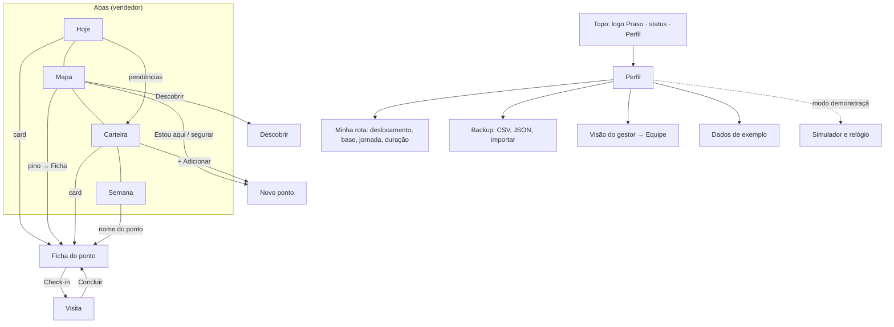

# Auditoria da V2 · plataforma de campo Praso

Escrita em 05/10/2026, antes da V2.1. A versão é para vendedores da Praso testarem na rua, não para avaliadores do case. Regra da revisão: **nenhuma função é apagada**. O que sai da tela vai para outro lugar (menu de perfil, modo demonstração, README).

**Prioridade:** **P0** quebra o uso na rua · **P1** confunde ou contradiz a Praso · **P2** acabamento.

**Como foi feita:**
- Leitura do README, CHANGELOG, `docs/PLANO_V2.md`, de todas as telas e dos motores.
- Leitura dos documentos do Project (case, críticas, positivos, hipóteses, roteiro, requisitos da V1, a Praso vista pelo comprador, estado e passagem da V2).
- Navegação no `praso.com.br` com um navegador de verdade, a 375 px.
- Varredura com Playwright no Chromium a 360 px (`qa/varrer.mjs`): print de cada tela, todo elemento com cara de clicável, nomes de ponto sem link, alvos menores que 44 px, rolagem horizontal e erros no console. Também foram testados os estados vazios, sem GPS, sem rede e o voltar.

Prints de antes: `docs/prints/v2.1/antes/`.

---

## A. Aderência à Praso real

Fontes: [praso.com.br](https://praso.com.br/), [cadastro](https://praso.com.br/account/register/cnpj), [termos de uso](https://praso.com.br/pages/termos-de-uso) e [App Store](https://apps.apple.com/br/app/praso/id1639578961), consultados em 05/10/2026.

### O que o site diz

| Tema | O que está no site |
|---|---|
| Cadastro (prints do Arthur, 06/10) | Sete passos: (1) e-mail para criar ou acessar a conta; (2) nome e WhatsApp, aceitando os termos; (3) nome do estabelecimento e CNPJ, ou CPF com data de nascimento; (4) endereço de entrega com busca, pino confirmado no mapa ("Seu pedido será entregue aqui"), número, complemento, ponto de referência e bairro; (5) "Como você conheceu a Praso?", com as opções Vendedor da Praso, Indicação de Amigo, Google, Instagram e Outro; (6) categoria (Restaurante, Açaí e Sorvetes, Comércio e Revenda, Bar e Petiscos, Barraca de Praia, Cafeteria…); (7) tipo dentro da categoria. Não pede documento nem dados do representante, e não tem etapa de crédito. |
| CPF × CNPJ | Na tela do CPF: "Cadastre-se com CNPJ e garanta ofertas de boas-vindas, isenção de taxa de serviço e 7 dias para pagamento, mediante análise de crédito". |
| Quem pode abrir | Pela regra dos termos: CNPJ ativo, uma conta por CNPJ, cadastro feito por quem representa a empresa. CPF é aceito a critério da Praso. |
| Dados pedidos | Pelos termos: CNPJ, razão social, endereço, telefone, e-mail e dados do representante legal. |
| Crédito e prazo | Pelos termos: crédito a critério da Praso, depois de análise (cadastro, bureaus, SCR). O limite pode ser reduzido ou cancelado. O boleto vai até 60 dias. Já a App Store anuncia "compre hoje e pague daqui a uma semana". |
| Pagamento | Boleto (à vista ou a prazo), PIX e cartão. |
| Condições comerciais | "Sem pedido mínimo", "Frete grátis para CNPJ", "Entrega em 24h", "\*Verifique as regiões elegíveis". |
| Prazo de entrega | Pela nota de rodapé: entrega no dia seguinte de segunda a sábado, das 6h às 19h, nas RMs de Recife, João Pessoa (sem sábado) e Fortaleza. |
| Corte | "Peça até 19h e receba amanhã", texto da versão desktop da página inicial. |
| Regiões | RM do Recife, Agreste/Zona da Mata de PE, RM de Fortaleza e Paraíba. |
| Atendimento | Segunda a sexta das 8h às 19h, sábado das 9h às 17h. |
| Linguagem | Fala com o cliente como "seu negócio": "A melhor forma de abastecer o seu negócio". Tem 15 departamentos: Confeitaria, Açougue, Mercearia, Laticínios Secos, Frios e Queijos, Snacks e Doces, Bebidas Não-Alcoólicas, Carnes, Aves e Pescados, Embutidos, Molhos, Temperos e Conservas, Bebidas Alcoólicas, Limpeza, Descartáveis e Embalagens, Congelados e Orientais. Mostra "Ofertas da Semana" e um botão flutuante de WhatsApp: "Primeira compra? Fale com o vendedor!". |
| Identidade visual | **Logo:** branca sobre azul. **Cores:** azul primário `#2053CE`, azul escuro `#123DA1`, azuis claros `#DCE6FD`, `#C0D3FD` e `#EFF4FF`, amarelo `#FAD705` só no "Cadastre-se", verde `#16A34A` no WhatsApp e neutros da escala cinza (`#111827`, `#4B5563`, `#6B7280`, `#E5E7EB`). **Fonte:** Inter Variable. **Botões:** raio de 6 a 8 px, peso 600. **Chips:** em pílula. **Sombra:** quase nenhuma (`shadow-sm`). **Ícones:** de preenchimento sólido, sobre um quadrado azul-claro. |

### O app contra o site

| O que o app diz | O que o site diz | Veredito | Fonte |
|---|---|---|---|
| Checklist da ficha: representante legal presente; CNPJ e e-mail; para prazo, dados do responsável financeiro e chave PIX do CNPJ | O app pede, em ordem: e-mail, nome e WhatsApp, estabelecimento e CNPJ, endereço com o pino no mapa, "Como conheceu a Praso?" e categoria. Os dados do responsável financeiro e o PIX aparecem nos termos para o crédito, não no cadastro | **Ajustado (P1):** o checklist vira o passo a passo real. O destaque é marcar **"Vendedor da Praso"**, que atribui o cliente ao vendedor, e conferir o pino da entrega | prints do cadastro |
| "Prazo depende de análise de crédito; não prometa" | O cadastro com CNPJ promete "7 dias para pagamento, mediante análise de crédito". Os termos falam em até 60 dias, a critério da Praso | **Ajustado:** "Com CNPJ, o cliente pode ter 7 dias para pagar, mas só depois da análise de crédito: não prometa" | prints do cadastro, termos |
| WhatsApp: "Sem pedido mínimo e frete grátis para CNPJ. Pedido até as 19h chega amanhã." | Igual, mas a entrega no dia seguinte vale de segunda a sábado, e João Pessoa não entrega no sábado | **Ajustar (P1):** "chega no dia seguinte (seg a sáb)". Pedido de sábado à noite chega na segunda | rodapé da página inicial |
| Categorias do catálogo fictício (Óleos e gorduras, Batata e congelados, Carnes e frios…) | 15 departamentos com nomes próprios | **Ajustar (P2):** usar os nomes dos departamentos onde houver um correspondente direto. A cesta de fritura continua: o site tem combos de gordura com batata | página inicial |
| Estados: Lead, Oportunidade, Em ativação, Recorrente, Ativação vencida, Oportunidade (churn) | O site não fala de funil. O case define Lead e Oportunidade, e Oportunidade cobre dois estados | **Ajustar (P1):** ver a frente D. "Oportunidade" fica como grupo; cada estado ganha um nome que o vendedor fala | case |
| Identidade: "Campo V2", azul `#0047b3`, fonte do sistema, bordas pretas de 2 px | Logo Praso, azul `#2053CE`, Inter, bordas cinza e raio de 8 px | **Ajustar (P1):** ver a frente F | site |

### O funil bate com o cadastro real?

- **A etapa "Cadastro" está certa:** o fluxo real termina sem nenhuma aprovação antes da primeira compra. O que muda o resultado é o **crédito**, que vem depois e só vale para quem quer prazo.
- **Crédito não vira etapa.** Quem paga com PIX ou cartão compra sem ele, e uma etapa a mais mediria o que o vendedor não controla.
- **Crédito vira atributo do ponto** (não pedido · em análise · aprovado com limite · negado). Isso atende H4 ajustada: "você já tem X de limite aprovado". Pede integração e campo novo no modelo, então fica como **proposta para produção**, sem mudar o schema na V2.1.
- **"Como você conheceu a Praso?" é dado de atribuição.** Se o dono marca "Vendedor da Praso", o cadastro é do vendedor. Em produção, essa resposta, cruzada com a visita do dia, é o evento "cadastro" do funil e a base da pontuação. Na V2.1 o passo vira item em destaque do checklist.
- **O pino do cadastro é o da entrega.** O dono confirma o pino no mapa do app. Fazer isso junto com o vendedor, no ponto, resolve o H2 também para a logística.

---

## B. Aderência aos documentos do Project

Status: ✅ resolve · ◐ parcial · ✗ não resolve. A coluna "V2.1" diz o que muda nesta versão.

### Críticas ao Salesforce (`Criticas_Salesforce_Praso_v2.xlsx`)

| # | Crítica | Tela que responde | V2 | O que falta · V2.1 |
|---|---|---|---|---|
| C1 | Conversão de lead irreversível | Ficha (estado + linha do tempo) | ✅ | — |
| C2 | "Oportunidade" com outro sentido | Selos de estado | ◐ | "Oportunidade (churn)" confunde. **V2.1:** grupo "Oportunidade", com Cadastrado e Churn |
| C3 | Sem enriquecimento | Novo ponto (BrasilAPI), Descobrir | ◐ | Places/Overture só como proposta |
| C4 | Deduplicação com endereço americano | Novo ponto (50 m + nome) | ✅ | — |
| C5 | Registro toma tempo | Visita (3 toques, pré-preenchido) | ✅ | **V2.1:** sai o texto de explicação da tela |
| C6 | Registro não devolve nada | Visita → próxima ação → Hoje | ✅ | **V2.1:** o retorno aparece no card como "Volta qui 14h" |
| C7 | App lento | Sem build, cache | ✅ | Falta medir em Android real |
| C8 | Offline pago | IndexedDB + diário + SW | ✅ | **V2.1:** fonte, logo e ícones entram no cache |
| C9 | Pinos somem por configuração | Mapa: todo ponto com coordenada aparece | ◐ | Ponto sem coordenada some do mapa sem aviso. **V2.1:** contagem "N sem pino" |
| C10 | Coordenada nasce do endereço | Check-in corrige o pino | ✅ | — |
| C11 | Sem ajuste manual do pino | Mapa (segurar e arrastar) | ✅ | — |
| C12 | Mapa é add-on pago | Leaflet/OSM | ✅ | — |
| C13 | Janela do decisor é o gargalo | Registro (faixas) → rota | ✅ | — |
| C14 | Visita é evento genérico | Visita com tipo e resultado | ✅ | — |
| C15 | CGC feito para carteira fixa | Hoje prioriza aquisição e recompra | ✅ | — |
| C16 | Pedido não chega ao CRM | Simulador | ◐ | Integração real fica para produção. **V2.1:** o simulador vai para o modo demonstração |
| C17 | Sem gatilhos de 45 e 120 dias | Motor de estados | ✅ | — |
| C18 | WhatsApp fora do CRM | Mensagem pronta, contato gravado | ✅ | **V2.1:** condições alinhadas ao site |
| C19 | Muitas ferramentas abertas | Ficha concentra tudo | ✅ | — |
| C20 | Reports não explicam o 2x | Visão do gestor | ✅ | **V2.1:** gestor vira papel separado |
| C21 | IA sobre dado pobre | Voz para capturar, regras para prever | ✅ | — |
| C22 | Pontuação invisível no ponto | Card e ficha | ✅ | **V2.1:** "3 pt" fica, e "≈2,04 pt esperados" sai do card |

### Positivos do Salesforce (`Positivos_Salesforce_Praso.xlsx`)

| # | Positivo | Na V2 | Observação |
|---|---|---|---|
| P01–P04, P16, P18 | Mercado, ecossistema e residência de dados | Fora do produto | Argumento da defesa (README) |
| P05 | Gatilhos em low-code | Preservado | Regras em `config.js` |
| P06 | Integração nativa | Perdido no protótipo | Simulador. Produção pede integração |
| P07 | Captura passiva | Preservado | Contato gravado no toque do WhatsApp |
| P08 | Check-in, check-out e voz | Preservado | — |
| P09 | Criar registro pelo mapa | Preservado | Click2Create |
| P10 | Priorização por dados | Preservado | Pontos esperados |
| P11 | Janela de visita na rota | Preservado | Roteirizador com janelas |
| P12 | Offline da carteira | Preservado | — |
| P13 | Histórico preservado | Preservado | Linha do tempo |
| P14 | Deduplicação nativa | Preservado | Coordenada + nome |
| P15 | Auditoria de campo | Preservado | `EventoEstado` só acrescenta |
| P17 | Lista do dia priorizada | Preservado | Hoje |
| P19 | Linha de base do Salesforce | ◐ | A migração do histórico é premissa de produção |

### Hipóteses

| H | Onde é atendida ou medida | V2 | V2.1 |
|---|---|---|---|
| H1 registro devolve algo | Tempo do registro (`tempos.nucleo_s`), "registrou antes de sair" no painel do gestor | ✅ | O rótulo "teste de H1" sai da tela |
| H2 pino é dado | `v2_checkin_distancia_pino_m`, pergunta "corrigir o pino?" | ✅ | — |
| H3 voz | Nota de voz, % de notas por voz no painel do gestor | ✅ | — |
| H4 caixa > preço | Pesquisa (forma e prazo), aviso de crédito | ◐ | Falta o limite aprovado na ficha (depende de integração) |
| H5 entrada por categoria | Cesta de entrada de uma categoria | ✅ | Nomes dos departamentos |
| H6 repetir pedido | Mensagem "repetir o último pedido", recompra vencendo | ✅ | — |
| H7 vendedor consultor | Prioridade por pontos esperados, minutos por visita no painel do gestor | ✅ | — |

### Exigências do case

| Exigência | Tela | V2 |
|---|---|---|
| Funil de 6 etapas, movido por evento | Carteira (Funil), motor | ✅ |
| Definições de Lead, Oportunidade e churn de 120 dias | Estados | ✅ (rótulos ajustados na V2.1) |
| Pontuação 0,5 / 1 / 3 | Card, ficha, Semana | ✅ |
| Recorrência = 3ª compra autônoma em 45 dias | Ficha de ativação, motor | ✅ |
| Queixa 1: pinos | Mapa, check-in | ✅ |
| Queixa 2: lento no celular | Stack e offline | ✅ (falta medir em aparelho real) |
| Queixa 3: pouca informação do lead | Ficha, BrasilAPI, Descobrir | ◐ (enriquecimento real fica para produção) |
| Queixa 4: registrar não ajuda | Visita → Hoje | ✅ |
| Por que alguns convertem o dobro | Visão do gestor | ✅ |
| Funciona no celular, publicado | PWA na Vercel | ✅ |

### Requisitos da V1

| Requisito | V2 | Observação |
|---|---|---|
| RF01 cadastrar ponto | ✅ | Novo ponto |
| RF02 Click2Create | ✅ | "Estou aqui" e segurar no mapa |
| RF03 lista do dia com estado e rota no Maps | ✅ | — |
| RF04 mapa embutido | ✅ | — |
| RF05 check-in com GPS | ✅ | — |
| RF06 núcleo em 3 toques | ✅ | — |
| RF07 pesquisa | ✅ | Recolhida |
| RF08 "o que me surpreendeu" | ✅ | — |
| RF09 check-out | ✅ | — |
| RF10 retornar com hora sugerida | ✅ | — |
| RF11 tempos e "voz ou digitação" | ✅ | — |
| RF12 exportar JSON e CSV | ✅ | **V2.1:** sai do topo e vai para Perfil → Backup |
| RNF01 alvos de 48 px, ações embaixo | ◐ | 4 links abaixo de 44 px (lista abaixo) |
| RNF02 legível no sol | ✅ | — |
| RNF03 offline-first | ✅ | — |
| RNF04 service worker | ✅ | — |
| RNF05 abrir em menos de 2 s | ✅ | Falta medir em 4G real |
| RNF06 exportar sempre visível | ◐ | Na V2.1, o export sai do topo. O aviso "N visitas sem backup" continua no Hoje e leva ao backup. Fica na mão do Arthur aprovar essa troca |
| RNF07 HTTPS | ✅ | — |
| RNF08 Vercel | ✅ | — |
| RNF09 ponto com estado | ✅ | — |
| RNF10 privacidade | ✅ | — |

### O que falta

1. **Limite de crédito na ficha (H4).** Depende de integração. Fica como proposta de produção.
2. **Integração com pedidos (C16, P06).** O simulador cobre o protótipo.
3. **Ponto sem coordenada.** Some do mapa sem aviso (C9).
4. **Volta dentro do app (P0).** No iPhone instalado como app não existe botão voltar, e as telas por cima (ficha, visita, novo ponto) escondem as abas. O vendedor fica preso.

### O que sobra

Funções que nenhum documento pede e só complicam a tela. Nenhuma é apagada: todas mudam de lugar.

| Função | Onde estava | Para onde vai |
|---|---|---|
| Simulador e relógio | Engrenagem do topo | Modo demonstração → Perfil |
| Exportar | Botão do topo | Perfil → Backup |
| Ajustes da rota, base e jornada | Fim do Hoje | Perfil → Minha rota |
| Duração da visita e nome do roteirizador | Fim do Hoje | A duração vai para Perfil → Minha rota. O nome do roteirizador vai para o README |
| Pontos esperados no card | Card | Ficha ("Por que ir hoje") |
| "Visão gestor" na mesma aba | Painel | Perfil → Visão do gestor (papel separado) |

---

## C. Interação (Playwright, Chromium, 360 px)

### Elementos

| Tela | Elemento | O que acontece | O que deveria acontecer | P |
|---|---|---|---|---|
| Hoje | Itens de "Não couberam" (caixa com nome e selo) | Nada | Abrir a ficha | P0 |
| Hoje | "+13: ver na Carteira (filtro 'prazo vencendo')" | Abre a Carteira **sem** o filtro | Abrir a Lista com "Prazo vencendo" ligado | P0 |
| Hoje | "+7 na Carteira." (retornos) | Texto que parece link | Link para a Lista filtrada | P1 |
| Hoje | Cabeçalhos dos blocos ("Retornos com hora 12") | Parecem botão e não fazem nada | Tirar a cara de botão | P2 |
| Hoje | Retorno que já está na rota | Aparece no bloco **e** na lista | Aparecer uma vez só, na lista, marcado "Volta 14h" | P1 |
| Semana (Painel) | Nomes dos pontos conquistados ("Pizzaria Quintal, …") | Texto | Cada nome abre a ficha | P0 |
| Semana | "Ver todas na Carteira (filtro…)" | Abre sem filtro; alvo de 18 px | Lista filtrada; alvo ≥ 48 px | P0 |
| Semana | Quadro "recompras em risco" | Parece botão e não faz nada | Abrir a Lista filtrada | P1 |
| Ficha | Título (nome do ponto) | Ok | — | — |
| Ficha | "Visita · …" na linha do tempo | Abre, mas com alvo de 20 px | Linha inteira com ≥ 48 px | P1 |
| Ficha | "simular evento neste ponto" | Abre o simulador | Só no modo demonstração | P1 |
| Ficha | Caixa "Último pedido" | Parece card e não faz nada | Tirar a cara de card | P2 |
| Visita | Nome do ponto | Texto | Abrir a ficha | P1 |
| Visita | "simular 'cadastro feito' (demo)" | Abre o simulador; alvo de 17 px | Só no modo demonstração | P1 |
| Mapa | Legenda (selos) | Parecem filtro | Ok como legenda; os filtros ficam nos chips | P2 |
| Mapa → outra aba | Sair do mapa durante a animação | Erro no console (`_leaflet_pos` de undefined) | Parar a animação antes de remover o mapa | P1 |
| Todas as telas por cima | Ficha, visita, novo ponto, Descobrir, simulador | Sem botão voltar e sem abas | Botão voltar no topo | **P0** |
| Topo | "Campo V2", engrenagem, "Exportar" | Ocupam o topo | Logo Praso, status e Perfil | P1 |

### Fluxos

| Fluxo | O que acontece | Veredito |
|---|---|---|
| Voltar do Android: ficha → Carteira | Volta à Lista e mantém o modo | Ok. A posição da rolagem se perde (P2) |
| Voltar da visita | Volta à ficha | Ok. O aviso "Visita aberta em … · continuar" aparece em todas as abas |
| Visita aberta + outra aba | O aviso aparece e leva de volta | Ok |
| Sem GPS | "GPS: permissão negada · Tentar de novo", e o registro segue | Ok |
| Sem rede | O app abre do cache e o mapa mostra os pinos | Ok. O aviso "sem rede" do mapa demora a aparecer (P2) |
| Carteira vazia (Hoje) | "Nada coube na jornada. Tente replanejar" | **Errado (P1):** deveria ser "Sua carteira está vazia" + "Adicionar ponto" |
| Carteira vazia (Carteira) | Mostra todos os filtros e "Nada com esses filtros" | **Errado (P1):** estado vazio próprio |
| Carteira vazia (Painel) | "Você está no nível do quartil de cima" com 0 pontos | **Errado (P1)** |
| Primeira abertura | Carrega sozinho 210 pontos fictícios | **P1 para o teste de rua:** só no modo demonstração. Sem demo, mostra boas-vindas com "Adicionar ponto" e "Ver com dados de exemplo" |

### Alvos menores que 44 px

| Tela | Elemento |
|---|---|
| Hoje | Link "+13: ver na Carteira" (39 px de altura) |
| Ficha | Link da visita na linha do tempo (20 px) e "simular evento neste ponto" (18 px) |
| Semana | "Ver todas na Carteira" (18 px) |
| Visita | "simular cadastro feito" (17 px) |
| Mapa | Zoom + e − do Leaflet (30 px) e pinos (30 px). Os pinos ficam: o popup tem os botões |

---

## D. Texto

### Textos que falam com o avaliador

| Tela | Texto | Proposta |
|---|---|---|
| Carteira | "Cada ponto está na etapa mais avançada do ciclo atual. Ninguém arrasta card…" | Remover (README) |
| Carteira | "Leads ainda não planejados e churns sem visita de reconquista. Entram na etapa 1…" | Reescrever: "Ainda não entraram numa lista do dia." |
| Hoje | "Duração da visita: … (padrão). Roteirizador: heurística…" | Mover: duração para Perfil → Minha rota; roteirizador para o README |
| Hoje | "A jornada de hoje já está no fim: este é o plano de amanhã." | Reescrever: título "Amanhã" e "Seu dia acabou. Este é o plano de amanhã." |
| Descobrir | "Estabelecimentos do ICP… Dados fictícios no protótipo; em produção…" | Reescrever: "Estabelecimentos perto de você que ainda não são da carteira." "(fictício)" só no demo |
| Painel gestor | "Visão do gestor sem login, com 5 vendedores fictícios…" | Só no demo: "Equipe de exemplo" |
| Painel gestor | "Tom mais escuro = maior taxa; o número está sempre na célula." | Remover |
| Painel gestor | "'Registro no ponto' = núcleo salvo antes do check-out (teste de H1)…" | Reescrever o cabeçalho: "Registrou antes de sair" |
| Painel | "· conta quando o ponto vira recorrente (3ª compra autônoma)" | Reescrever: "Conta na 3ª compra pelo app." |
| Ficha | "Só para erro de registro. Precisa de confirmação, fica no histórico…" | Reescrever: "Use se marcou errado. Fica no histórico." |
| Ficha | "simular evento neste ponto" | Só no demo |
| Ficha | "Preços do catálogo fictício." | Só no demo |
| Ficha | "Estado declarado (pontos sem histórico, como os migrados da V1)" | Reescrever: "Estado (ponto sem compras registradas)" |
| Visita | "simular 'cadastro feito' (demo)" | Só no demo |
| Visita | "O relógio do registro começa no primeiro toque." | Remover. Mostrar só "Falta o resultado" |
| Visita | "É a sua nota sobre a visita… Não é gravação da conversa com o dono." | Reescrever: "Sua nota, depois de sair. Não grave o cliente." |
| Mapa | "Segure no mapa para criar um ponto ali. Segure um pino…" | Manter, mais curto: "Segure no mapa para criar um ponto. Segure um pino para mudar de lugar." |
| Novo ponto | "a plataforma busca na Receita (BrasilAPI)" | Reescrever: "Com 14 dígitos, buscamos os dados na Receita." |
| Topo | Toast "210 pontos fictícios carregados para a demonstração" | Só no demo |
| Simulador | "Painel de demonstração. Em produção…" | Fica (só aparece no demo) |
| Status (toque no ponto verde) | "Sem backend no protótipo: os dados ficam neste aparelho." | Reescrever: "Tudo salvo neste aparelho. Faça backup em Perfil." |

### Rótulos, com os olhos do vendedor

A chave interna não muda, então o export continua igual. Muda só o que aparece na tela.

| Hoje | O vendedor diria | Definição do case por trás |
|---|---|---|
| Lead | **Lead** | Nunca se cadastrou |
| Oportunidade | **Cadastrado** (grupo Oportunidade) | Cadastrou e nunca comprou |
| Em ativação | **Ativando · 2/3** | Entre a 1ª e a 3ª compra, dentro de 45 dias |
| Recorrente | **Recorrente** | 3ª compra autônoma em até 45 dias |
| Ativação vencida | **Vencido** ("passou dos 45 dias sem a 3ª compra") | 45 dias sem a 3ª compra autônoma |
| Oportunidade (churn) | **Churn** (grupo Oportunidade, "140 dias sem comprar") | Mais de 120 dias sem comprar |
| ≈2,04 pt (pontos esperados) | **"pt prováveis"** (só na ficha e no total do dia) | valor × chance hoje |
| Etapa 1–6 | Nome da etapa, sem número: "Decisor encontrado", "1ª compra" | 6 etapas do case |
| Núcleo | **Registro** | RF06 |
| Quartil de cima | **Os melhores do time** | Top 25% da conversão |
| Ativação vencida "faltam 7 dias para os 45" | **"Faltam 7 dias para a 3ª compra"** | Prazo de 45 dias |
| Autônoma / assistida | **"pelo app"** / **"com você"** | Flag `autonomo` |

---

## E. Arquitetura de informação para produção

### Personas, trabalhos e a pergunta de cada aba

| Persona | Trabalho | Pergunta | Onde |
|---|---|---|---|
| Vendedor na rua | Visitar e registrar | "Para onde vou agora e o que faço lá?" | **Hoje** → card → **Visita** |
| Vendedor na rua | Encontrar ponto novo | "O que tem aqui perto?" | **Mapa** (Descobrir, Click2Create) |
| Vendedor planejando a semana | Cuidar da carteira | "Quem está esfriando? Onde meu funil trava?" | **Carteira** (Funil e Lista) |
| Vendedor | Acompanhar a meta | "Como estou na semana?" | **Semana** |
| Gestor | Treinar o time | "Quem converte o dobro e por quê?" | **Equipe** (papel separado: em produção, login de gestor) |

### Mapa do app

Toda tela por cima (ficha, visita, novo ponto, Descobrir, Perfil, Equipe, simulador) tem **voltar** no topo.

### Hierarquia de cada tela

| Tela | Primeiro | Recolhido | Sai |
|---|---|---|---|
| Hoje | Título do dia + 1 linha de resumo. Em seguida, uma faixa de pendências com até 3 chips (retornos fora da rota, recompras vencendo, pontos a verificar) e a **lista do dia** | Visitados, Não couberam, Adicionar à lista | Blocos grandes do topo, ajustes da rota (Perfil), texto do roteirizador |
| Card | Linha 1: ordem, nome, hora. Linha 2: estado, pt e a situação ("Faltam 3 dias para a 3ª compra"). Linha 3: o porquê ou a próxima ação ("Volta combinada 14h · decisor 14h–17h"). Ações ao lado: Tirar e Rota | — | Tipo e bairro, pt esperados, a linha "Decisor" separada, a linha "Próxima" quando repete o porquê |
| Ficha | Nome, estado, pt e prazo. **Próxima ação** em destaque. Decisor e quem paga. Bloco do estado (checklist, ativação, churn) | Cadastro e pino, Corrigir registro, Demonstração | Texto de avaliador |
| Visita | Nome (abre a ficha), check-in e GPS, pino, **Registro em 3 toques**, próxima ação | Pesquisa, "mais do roteiro" | "Simular" fora do demo, texto do relógio |
| Carteira | Funil ou Lista | "Fora do funil agora" | Texto de regra |
| Semana | Pontos da semana (nomes clicáveis), funil × os melhores, recompras em risco (clicável) | — | Seletor do gestor |
| Perfil | Minha rota · Backup · Visão do gestor · Dados de exemplo · Modo demonstração | — | — |

### O que muda com login e backend

| Hoje no protótipo | Em produção |
|---|---|
| Export manual e aviso "N visitas sem backup" | Sincronização automática. O export vira relatório |
| Visão do gestor no Perfil, com equipe fictícia | Papel "gestor" no login, com a equipe real. O vendedor não vê a aba |
| Simulador de cadastro e pedido | Eventos chegam da integração com o sistema de pedidos |
| Base e jornada no aparelho | Vêm do cadastro do vendedor. O gestor define a meta |
| Dados de exemplo | Ambiente de treino separado |
| Um vendedor fixo (`v-voce`) | `vendedor_id` do login; carteira por território |

---

## F. Design alinhado à Praso

### Tokens

| Token | Valor | Uso | Contraste |
|---|---|---|---|
| `--praso` | `#2053CE` | Primária: topo, botão principal, links | 6,6:1 em branco |
| `--praso-escuro` | `#123DA1` | Pressionado, títulos de destaque | 9,5:1 |
| `--praso-claro` | `#DCE6FD` | Fundo de ícone, seleção suave | texto `#123DA1` 7,6:1 |
| `--praso-fundo` | `#EFF4FF` | Faixas e blocos | — |
| `--destaque` | `#FAD705` + texto `#030712` | Uma ação por tela no máximo (ex.: "Check-in"), como o "Cadastre-se" do site | 14:1 |
| `--zap` | `#15803D` | Botão de WhatsApp. O verde do site (`#16A34A`) não passa AA com texto branco | 5,0:1 |
| Neutros | `#111827` texto, `#4B5563` sutil, `#D1D5DB` linha, `#F3F4F6` cartão, `#FFFFFF` fundo | — | sutil 7,6:1 |
| Estados | Lead `#4B5563` · Cadastrado `#2053CE` · Ativando `#B45309` · Recorrente `#15803D` · Vencido `#7E22CE` · Churn `#B91C1C` | Selo = cor + ícone + texto | todos ≥ 5:1 com texto branco |

### Tipografia, forma e ícones

- **Fonte:** Inter Variable, a fonte do site. A licença é SIL OFL 1.1, que permite servir o arquivo localmente. O `woff2` fica em `public/fonts/` e entra no cache do service worker.
- **Pesos:** 400 texto, 600 botões, 700 títulos, 800 números.
- **Escala:** 13 · 15 · 16 (corpo) · 18 · 22 · 26.
- **Raios:** 8 px em botões e cards, 6 px em selos, pílula nos chips.
- **Espaçamento:** base de 4 px; 16 px de margem lateral.
- **Sombra:** só `0 1px 2px rgb(0 0 0 / .06)` nos cards, como o site. Para o sol, a borda dos cards é `#D1D5DB` e a dos controles é azul ou preta.
- **Ícones:** Lucide (licença ISC, do mesmo tipo da MIT), em SVG local num sprite (`public/icons.svg`), no lugar das letras soltas dos selos. No pino do mapa a letra fica, porque o pino tem 30 px.
- **Regras que ficam:** contraste AA, tema claro, alvos de 48 px e estado sempre com cor e texto.

### Logo

O app usa o arquivo `logo_praso.png` do Project, só recortado. Não redesenho nem recrio a logo.
- **Topo:** a versão branca sobre o azul `#2053CE`.
- **Ícone do app:** o símbolo recortado do mesmo arquivo.

### Antes e depois

As maquetes de Hoje e da ficha são os próprios prints da V2.1 (`docs/prints/v2.1/depois/`), lado a lado com os de antes.

---

## Fechamento: lista priorizada

| # | P | Mudança | Fatia | Esforço |
|---|---|---|---|---|
| 1 | P0 | Botão voltar no topo de toda tela por cima | 1 | 30 min |
| 2 | P0 | "Não couberam" e qualquer nome de ponto abrem a ficha (Hoje, Semana, visita) | 1 | 30 min |
| 3 | P0 | Links "ver na Carteira" aplicam o filtro de verdade (`#/carteira?filtro=prazo`) | 1 | 20 min |
| 4 | P1 | Quadro "recompras em risco" e "+N na Carteira" viram links; alvos ≥ 48 px | 1 | 20 min |
| 5 | P1 | Erro do Leaflet ao sair do mapa | 1 | 10 min |
| 6 | P2 | Rolagem lembrada ao voltar | 1 | 15 min |
| 7 | P1 | Modo demonstração (`?demo=1` ou 5 toques na logo): simulador, relógio, "fictício", "simular" | 2 | 1 h |
| 8 | P1 | Menu de perfil: Minha rota, Backup, Visão do gestor, Dados de exemplo, Modo demonstração | 2 | 1 h |
| 9 | P1 | Texto de avaliador sai; microtexto de vendedor entra (frente D) | 2 | 45 min |
| 10 | P1 | Primeira abertura sem demo: boas-vindas em vez do seed automático | 2 | 20 min |
| 11 | P1 | Estados vazios de Hoje, Carteira e Semana | 2 | 30 min |
| 12 | P1 | Hoje enxuto: faixa de pendências, sem duplicação de retornos, lista logo abaixo | 3 | 1 h 30 |
| 13 | P1 | Card com no máximo 3 linhas de informação | 3 | 45 min |
| 14 | P1 | Gestor como papel separado (tela Equipe, fora da aba) e aba "Semana" | 3 | 30 min |
| 15 | P1 | Rótulos de estado e termos de vendedor (frente D) | 3 | 30 min |
| 16 | P1 | Tokens, Inter local, logo, ícones Lucide, cards, botões | 4 | 2 h |
| 17 | P1 | Checklist de cadastro e condições do WhatsApp iguais ao site | 5 | 30 min |
| 18 | P2 | Nomes dos departamentos no catálogo fictício | 5 | 20 min |
| 19 | P2 | Contagem de pontos sem pino no Mapa | 5 | 15 min |

### Dúvidas que bloqueiam (dependem de você ou do gestor)

1. ~~Passo 2 do cadastro~~: respondido pelos prints (frente A).
2. **Crédito.** O vendedor enxerga o limite aprovado do cliente? Se sim, a ficha ganha esse campo (muda o schema).
3. **Primeira abertura.** Vendedor de teste começa com a carteira vazia (minha proposta) ou com os dados de exemplo?
4. **Exportar fora do topo.** Isso contraria o RNF06 da V1 ("sempre visível"). Proponho que o aviso de visitas sem backup no Hoje cumpra esse papel.
5. **Nomes dos estados.** "Cadastrado", "Ativando", "Vencido" e "Churn", com "Oportunidade" como grupo. É assim que o time fala?

---

## Status depois da V2.1 (06/10/2026)

Os 19 itens da lista foram feitos, em 5 fatias com commit próprio (ver `CHANGELOG.md`). A pedido do Arthur, a correção foi junto com a auditoria, sem esperar aprovação.

| Verificação | Resultado |
|---|---|
| `npm test` | 67 testes passando (eram 61). Novos: modo demonstração, mensagens e cesta |
| Playwright a 360 e 412 px | Sem rolagem horizontal e sem erro no console. Todos os alvos têm 48 px ou mais, inclusive os pinos e o zoom do mapa |
| Elementos com cara de clicável | Todo nome de ponto abre a ficha. Selos, quadros e caixas perderam a cara de botão |
| Offline | Abre sem rede, com fonte e logo, registra visita, recarrega e o dado continua lá |
| Modelo de dados e export | Sem mudança. Os rótulos trocaram e as chaves ficaram |

Prints: `docs/prints/v2.1/antes/`, `docs/prints/v2.1/depois/`, `comparacao-hoje.png` e `comparacao-ficha.png`.

**O que ficou de fora:**
- **Limite de crédito na ficha.** Depende de integração e de campo novo no modelo.
- **Tipo "Açaí e Sorvetes" e outras categorias do app.** Pede chave nova no catálogo de tipos.
- **Teste em Android real e iPhone.**

---

## V2.2 (06/10/2026)

Duas fases com uma trava no meio: a Fase A não depende do campo, e a Fase B só começa com as notas de campo do Arthur.

**Fase A, o que fechou:**
- **A1 · Seed coerente com a H1.** O registro do "Você" no exemplo tinha média perto de 42 s, contra a meta de menos de 20 s. Agora 70% das visitas ficam entre 10 e 22 s e 30% entre 23 e 45 s, e o seed continua determinístico (`tests/seed.test.mjs`).
- **A2 · "Oportunidades" na Carteira.** O chip liga Cadastrado e Churn juntos, e o link `#/carteira?filtro=oportunidade` abre a Lista assim. Chaves e rótulos não mudaram.
- **A3 · README.** Novas seções "A aposta" e "Como provar que funciona", e o link de avaliação com `?demo=1` em "Como rodar".

| Verificação | Resultado |
|---|---|
| `npm test` | 69 testes passando (eram 67). Novos: faixa do tempo de registro do seed e determinismo |
| Playwright a 360 e 412 px | Hoje, Mapa, Carteira (com e sem o filtro de oportunidade), Semana, Perfil, Equipe, Descobrir, Novo ponto e ficha: sem rolagem horizontal, sem erro de script e com todos os alvos de 48 px ou mais. O único erro de rede é o dos blocos do mapa, que o ambiente de teste não alcança |
| Schema e export | Sem mudança |
| Service worker | `VERSAO` trocada para `campo-v2-2-2026-10-06-1` |

**Fase B, o que fechou (cenário simulado, sem calibração de campo):**
- **B1 · Regras como palpite.** As visitas de campo foram poucas para recalibrar. Nenhum valor mudou: todos ganharam a marca `PALPITE (V2.2)`, e a calibração foi para "próximos passos" no README.
- **B2 · O motivo devolve algo.**
  - `CONFIG.motivos` define a próxima ação, o argumento e o porquê de cada motivo.
  - A linha "Da última vez" aparece na ficha e no card do Hoje.
  - "Não é ICP" sai da lista do dia.
  - A Equipe ganhou a seção "Por que não avançou", e a Semana, os 3 motivos da semana.
  - O seed ganhou 6 leads com motivo e retorno hoje ou amanhã, e a equipe de exemplo, motivos determinísticos.
- **B3 · Do cadastro ao 1º pedido.** Com o cadastro feito na visita, o destaque troca para o 1º pedido com a cesta de entrada. A próxima ação passa a ser "Acompanhar 1ª compra" no dia seguinte. A chance sobe até 10 dias depois do cadastro e cai depois de 30 dias sem compra.

| Verificação da Fase B | Resultado |
|---|---|
| `npm test` | 84 testes passando (eram 69). Novos: `motivos.test.mjs` e `cadastro.test.mjs` |
| Playwright a 360 e 412 px, às 10h e à noite | Todas as telas, a ficha com motivo, a ficha "Não é ICP" e a visita com motivo: sem rolagem horizontal, sem erro no console e com alvos de 48 px ou mais |
| Schema e export | Sem mudança. Chaves, colunas e catálogos são os mesmos |

**Ficou de fora da Fase A:**
- **A coluna "Registro (s)" da Equipe mostra a média, não a mediana.** Com a distribuição pedida, o "Você" aparece com cerca de 22 s, ainda acima da meta de 20 s. A mediana do seed fica perto de 18 a 20 s. Mudar o cálculo do painel não estava no escopo.
- **Card do Hoje com 4 linhas.** "Da última vez" vira uma 4ª linha quando há motivo, como o prompt pede. Isso quebra a regra de no máximo 3 linhas da V2.1.
- **Aviso duplicado na visita.** Com o cadastro feito, o destaque novo e o aviso antigo ("Cadastro feito no app durante a visita") aparecem juntos. O aviso antigo ficou porque o prompt não fala dele.
